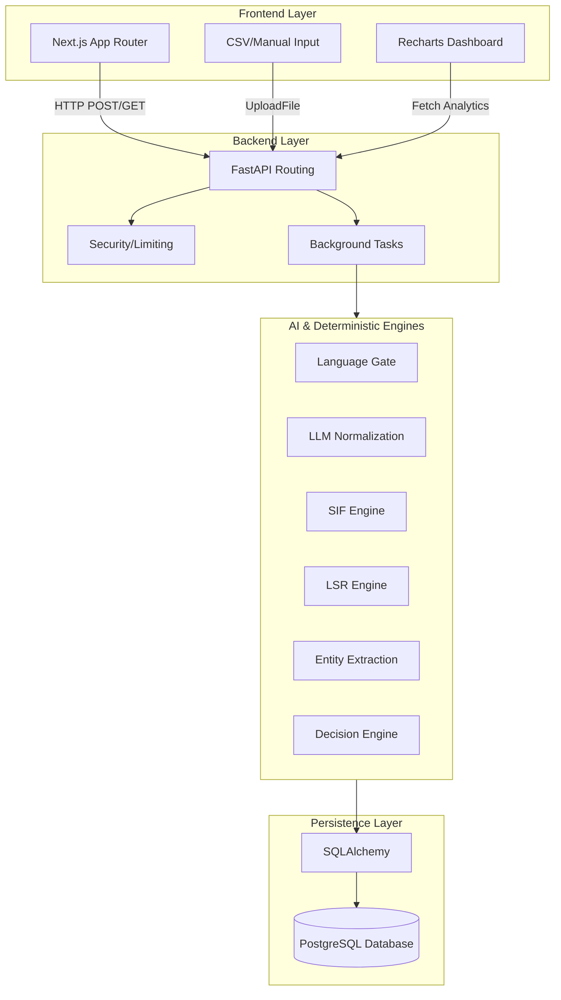

# System Architecture

The SIF (Serious Injury and Fatality) Precursor system is designed with a modern decoupled architecture, splitting the user interface and API layer into two distinct applications: a Next.js frontend and a FastAPI backend. This architecture allows for independent scaling, clear separation of concerns, and rapid iteration.

## High-Level Architecture

The system utilizes a **Client-Server Architecture**, specifically tailored for heavy data processing and real-time dashboard updates.

### 1. The Frontend Layer
Built with **Next.js 14 (App Router)**, the frontend serves as a presentation and interaction layer. It uses server-side rendering (SSR) for fast initial loads and client-side React components for interactive dashboards (via Recharts). Data is fetched from the backend API using RESTful calls.
- **Why separated?** Isolates heavy AI compute from the UI thread, ensuring the dashboard never hangs while generating reports.

### 2. The Backend Layer
Powered by **FastAPI**, the backend acts as the orchestrator. It handles incoming HTTP requests, validates them using Pydantic, and queues heavy processing jobs to avoid blocking the main event loop.
- **Background Tasks:** Used extensively. When a large CSV is uploaded, the backend returns an immediate `202 Accepted` response while background tasks process each row asynchronously.

### 3. The Core Engines (Hybrid Pipeline)
The application avoids relying entirely on LLMs by using a **Hybrid Pipeline**.
- **Deterministic Rules & Token-Awareness:** Fast, reliable rules engines are used first. The system utilizes `nlp_utils.py` for token-aware context extraction, ensuring word boundaries are respected.
- **Dynamic Metadata Routing:** The report's metadata (e.g., `report_type`) is piped directly into the engines to intelligently apply risk multipliers (e.g., 1.3x for Incidents) and bypass irrelevant rules (e.g., skipping driving checks for spills).
- **LLM Fallback/Augmentation:** Large Language Models (Gemini/Groq) are used strictly for normalization (translating complex slang/Hinglish to standard English) and entity extraction, where deterministic rules fall short.

### 4. The Persistence Layer
An **SQLAlchemy ORM** connects the application logic to a robust **PostgreSQL** database. This provides ACID compliance, high concurrency for background workers, structured schemas (Reports, Predictions, Entities), and future-proof scaling for pgvector.

## Request Lifecycle (Example: Uploading a Report)
1. **Intake:** User uploads a text report via the React UI.
2. **API Reception:** FastAPI receives the payload, hashes the text for deduplication, and creates a `READY` record in SQLite.
3. **Queueing:** A background task is spawned. The API immediately returns the job ID to the frontend.
4. **Processing Pipeline:** The text passes through the Preprocessor -> Language Gate -> LLM Normalization -> Parallel AI/Deterministic Engines -> Decision Engine.
5. **Persistence:** The final risk score, extracted entities, and LSR violations are committed to the DB.
6. **UI Update:** The user's dashboard fetches the latest API analytics, updating the "Total Reports" and "High Risk" counters.
