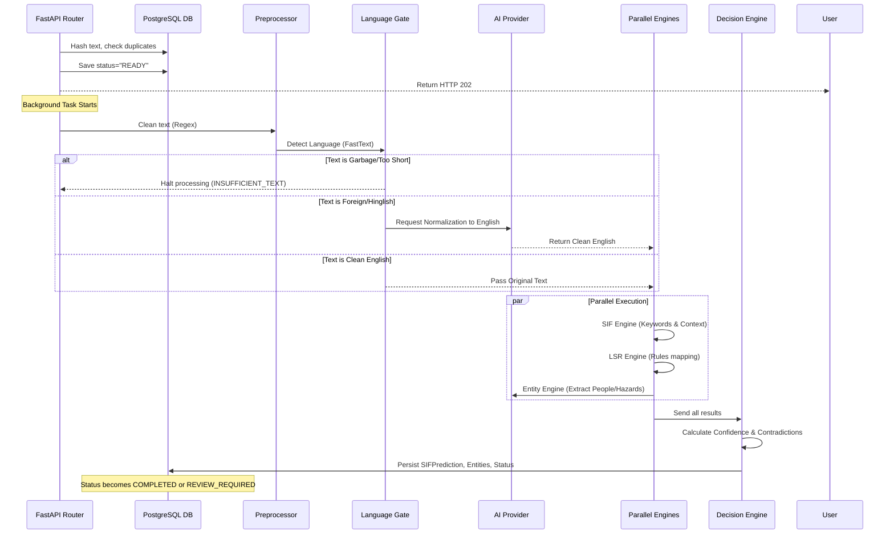

# Application Flow

This document details the complete end-to-end flow of data through the SIF Precursor system, broken down into User/Frontend Flow and Backend Processing Flow.

## 1. User & Frontend Flow

### A. Report Ingestion
1. **Manual Entry:** The user navigates to the upload page and types or pastes a raw safety observation into the text area.
2. **Bulk CSV Upload:** Alternatively, the user uploads a CSV file containing hundreds of historical observations.
3. **Frontend Action:** The Next.js client intercepts the submission, packages it into a JSON payload (or multipart form data), and POSTs it to the FastAPI backend.
4. **Immediate Feedback:** The backend immediately acknowledges receipt (`202 Accepted`) and the UI displays a "Processing in background..." notification.

### B. Dashboard Monitoring
1. **Metric Cards:** The user opens the Dashboard (`/`). The UI fetches `/api/v1/analytics/dashboard`.
2. **Display:** The UI updates the Metric Cards: Total Reports, SIF Potential, and Pending Review.
3. **Drill-down:** The user clicks the "SIF Potential" card. The Next.js router transitions to `/reports?riskFilter=SIF`.

### C. Review & Override
1. **Report Detail:** The user clicks a specific report from the table to view its raw text vs. the AI's extraction (Entities, Hazards, Life Saving Rules).
2. **Human-in-the-Loop:** If the Decision Engine flagged the report for manual review (e.g., conflicting data or low confidence), the user can accept, edit, or reject the AI's findings.
3. **Confirmation:** Clicking "Confirm" POSTs a decision back to the API, updating the report's status to `COMPLETED` and removing it from the pending review queue.

---

## 2. Backend Processing Flow

When a report text hits the backend (e.g., `Worker slipped on wet floor near the generator`), it goes through a highly orchestrated pipeline.

### Detailed Pipeline Steps

1. **Deduplication:** Before any work begins, the text is hashed (`SHA-256`). If the hash exists in the database, the system instantly returns the existing report, saving compute.
2. **Preprocessing:** Strips out PII (like phone numbers/emails), redundant whitespace, and special characters.
3. **Language Gate:** Uses FastText. If the text is purely English, it bypasses the LLM translation step entirely, saving latency and money. If it contains Hinglish or slang, it invokes the LLM `normalize_text` function.
4. **Parallel Engines:** To maximize speed via Python's `asyncio`, the SIF, LSR, and Entity engines all run concurrently.
5. **Decision Orchestrator:** Acts as the final judge. It looks at the outputs of all 3 engines. If the Entity engine found "Fire" but the SIF engine scored a 0.1, the Decision Engine flags a "Contradiction" and sets the report status to `REVIEW_REQUIRED`.
