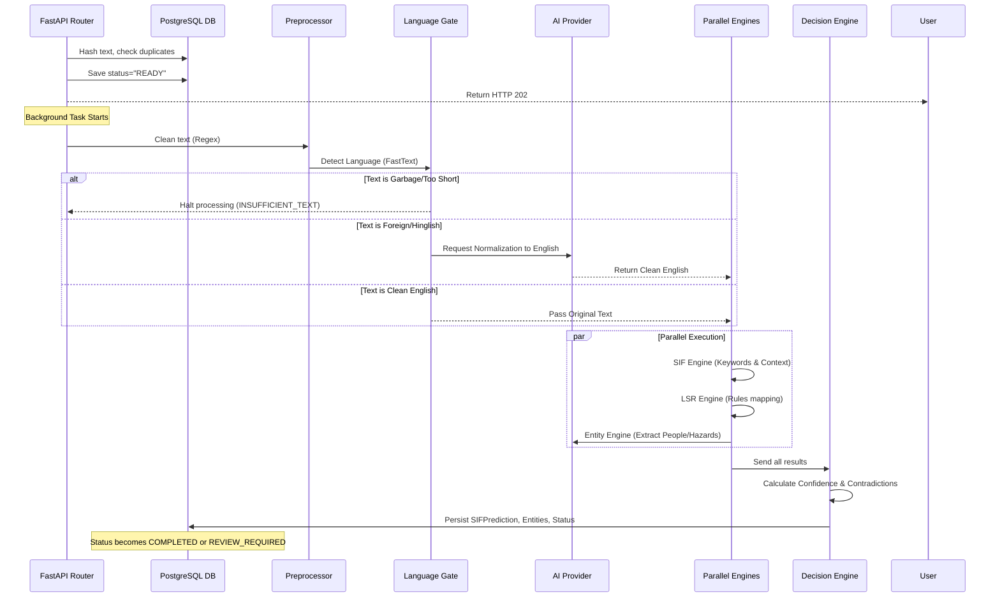

# Application Flow

This document details the complete end-to-end flow of data through the SIF Precursor system, broken down into User/Frontend Flow and Backend Processing Flow.

## 1. User & Frontend Flow

### A. Report Ingestion
1. **Live Analysis Sandbox (`/analyze`):** The user tests reports synchronously. This is a pure sandbox; it strips out metadata overhead and doesn't write to the database.
2. **Manual Entry (`/ingestion`):** The user submits an official report. The backend auto-generates a `source_record_id` if missing, saves it to the database, and begins processing.
3. **Bulk CSV Upload:** The user uploads a CSV file containing hundreds of historical observations.
4. **Immediate Feedback:** For official ingestions, the backend acknowledges receipt (`202 Accepted`) and the UI displays a processing notification while background workers spin up.

### B. Dashboard Monitoring
1. **Metric Cards:** The user opens the Dashboard (`/`). The UI fetches `/api/v1/analytics/dashboard`.
2. **Display:** The UI updates the Metric Cards: Total Reports, SIF Potential, and Pending Review.
3. **Drill-down:** The user clicks the "SIF Potential" card. The Next.js router transitions to `/reports?riskFilter=SIF`.

### C. Review & Override
1. **Report Detail:** The user clicks a specific report from the table to view its raw text vs. the AI's extraction (Entities, Hazards, Life Saving Rules). The UI fetches sequential AI Summaries and AI Suggestions from the LLM provider for contextual review.
2. **Human-in-the-Loop:** The user can confirm or edit the AI's findings. The UI blocks the "Override / Edit" button during active AI generations to prevent race conditions.
3. **Confirmation:** Clicking "Confirm" or saving an "Edit" POSTs a decision back to the API, updating the report's status to `COMPLETED` and logging the action in the `review_actions` table.

---

## 2. Backend Processing Flow

When a report text hits the backend (e.g., `Worker slipped on wet floor near the generator`), it goes through a highly orchestrated pipeline.

### Detailed Pipeline Steps

1. **Deduplication:** Before any work begins, the text is hashed (`SHA-256`). If the hash exists in the database, the system instantly returns the existing report, saving compute.
2. **Preprocessing:** Strips out PII (like phone numbers/emails), redundant whitespace, and special characters.
3. **Language Gate:** Uses FastText. If the text is purely English, it bypasses the LLM translation step entirely, saving latency and money. If it contains Hinglish or slang, it invokes the LLM `normalize_text` function.
4. **Parallel Engines:** To maximize speed via Python's `asyncio`, the SIF, LSR, and Entity engines all run concurrently.
5. **Decision Orchestrator:** Acts as the final judge. It looks at the outputs of all 3 engines. If the Entity engine found "Fire" but the SIF engine scored a 0.1, the Decision Engine flags a "Contradiction" and sets the report status to `REVIEW_REQUIRED`.
